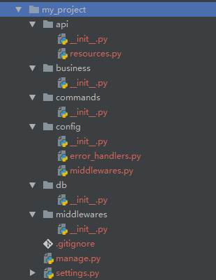

### 快速上手

1. 安装rust
>pip install -U git+https://github.com/limoxi/rust.git

2. 新建项目(当前目录下)
>rust-cli init my_project && cd my_project  

此时可观察my_project中的文件和目录结构，如图：  
 
```
api =>REST API层，负责响应HTTP请求  
business =>业务层
commands =>命令、脚本
config =>配置文件
db =>资源orm
middlewares =>中间件
manage.py =>功能同django的命令管理功能，具体命令存放于commands目录下
settings.py =>项目配置
```

3. 配置数据库连接(当前只支持mysql)
```
创建本地数据库
CREATE DATABASE rust;
创建用户并赋予权限
CREATE USER ruster@localhost IDENTIFIED BY 'test';
GRANT ALL ON rust.* TO ruster@localhost;
修改settings.py中DB_NAME，DB_USER，DB_PASSWORD，DB_HOST，DB_PORT为本地数据库相应的值
同步数据库models
python manage.py syncdb
```

4. 本地运行项目
>python manage.py runserver

