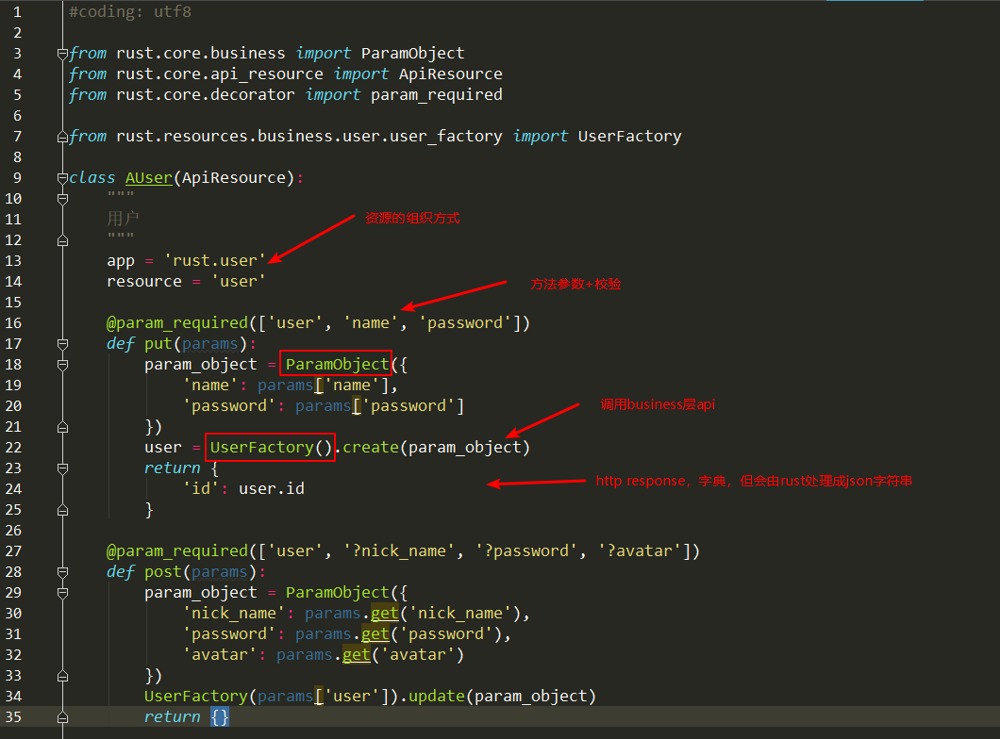

### 架构
在[快速上手](./1.md)中成功跑起新项目(my_project)后, 接下来仔细看一下api、business、db这3个文件夹下的文件,
可以看出项目是分层结构的, 从上到下依次为REST层、业务逻辑层和数据存储层

1. REST层
采用RESTful架构设计, 每个api即是一个资源的表述(注意，资源的表述使用名词)。
HTTP方法支持GET和POST，但是在api中被映射成了get、put、post、delete4种方法，分别代表对资源的查询、新增、修改、删除操作，
通过uri中的_method实现，若要对资源进行put、delete操作，则必须设置_method的值为put、delete，get和post可以省略，来看以下api代码:

注意到代码中出现了ParamObject，UserFactory，这是领域驱动设计的元素。
REST层只负责接收、响应http请求，将请求格式化后转交给下一层处理，并将处理结果格式化后返回给http响应。

2. 业务逻辑层
遵循领域驱动设计，将业务抽象成各领域模型，通过model，factory，repository，service，event对业务逻辑进行整合

3. 数据存储层
ORM应用